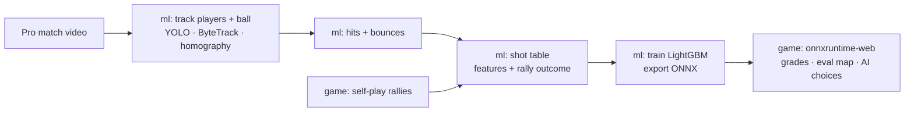

# Dink Engine

A 3D pickleball doubles game for training shot selection, plus the machine-learning pipeline that teaches it.
You play rallies at game speed; when a ball is coming to you, time slows so you can make the call. A
shot-value model scores every option, grades your choice, colors the court by win chance, and drives the
AI opponents. The model is trained by the pipeline in `ml/`, first on simulated rallies and then on
tracked pro footage.



## Repository layout

| Path | What's there |
|---|---|
| `game/` | The game: TypeScript, Three.js rendering, Rapier physics, post-processing, ONNX model loading, Vitest tests |
| `game/src/sim/` | Rules, ball flight, AI and shot calls. No rendering, so it runs in tests and headless self-play |
| `game/src/engine/` | Rule engine (fallback scorer + execution odds), feature contract, model connector, drills |
| `game/public/models/` | The trained model the game loads (`shot_value.onnx` + `model_card.json`) |
| `ml/` | Python pipeline: court calibration, tracking, event detection, shot table, training, ONNX export, pytest tests |
| `docs/` | Architecture and the model input contract |
| `.github/workflows/` | CI, GitHub Pages deploy, one-click model retraining |

## Play locally

```bash
cd game
npm install
npm run dev        # http://localhost:5173
```

Controls: WASD or arrows to move, 1–6 to pick a shot, mouse to aim, click or Space to hit, L to leave an
out ball, R to replay after a point, E eval map, F footwork assist, P pause.

## Train the model

```bash
# 1. simulated rallies (about a minute for 30,000)
cd game && npm run selfplay -- 30000 ../ml/data/selfplay.csv

# 2. train and export straight into the game
cd ../ml
pip install -e ".[dev]"
python -m dink_ml.train data/selfplay.csv --out ../game/public/models
```

### From pro footage

```bash
pip install -e ".[cv]"   # adds Ultralytics YOLO and Supervision (pulls in PyTorch)
# calibrate the camera once per broadcast angle: pixel positions of at least 4 court landmarks
dink-ml calibrate configs/my_court.json --point near_left 268 668 --point near_right 1012 668 \
  --point far_left 462 248 --point far_right 818 248
dink-ml track match.mp4 --court configs/my_court.json --ball-model ball.pt --out data/tracks.csv
# label rally start/end frames and the winning side in data/rallies.csv, then:
dink-ml shots data/tracks.csv data/rallies.csv --out data/shots.csv
dink-ml train data/shots.csv data/selfplay.csv --out ../game/public/models --source "PPA 2026 + self-play"
```

The ball model is a YOLO detector fine-tuned on pickleball frames (Roboflow Universe has CC BY 4.0
pickleball datasets to start from). `configs/court_broadcast_example.json` holds example landmark pixels
for a 1280×720 behind-the-baseline camera; recalibrate for your footage. Broadcast footage belongs to the
tours and broadcasters, so check their terms before collecting at scale.

### About the bundled model

It's trained on 213,300 shots from 30,000 simulated rallies. Validation AUC is 0.58, which is expected
for this target: whether a team wins a rally depends on many shots after the one being scored, so any
single shot only moves the odds a few points. The model agrees with the rule engine on the best shot type
in 10 of the 12 drill positions. Its value comes from ranking options against each other, and it will
change once it's trained on real shots.

## GitHub

- **CI** (`ci.yml`): type check, unit tests and production build for the game; pytest for the pipeline.
- **Deploy** (`pages.yml`): builds the game and publishes it to GitHub Pages on every push to `main`.
  Pages on a private repository needs a paid GitHub plan.
- **Retrain** (`retrain.yml`): run it from the Actions tab. It simulates rallies, retrains (mixing in any
  real shot tables in `ml/data/real/`) and opens a pull request with the new model and its metrics.

## Dependencies

Every dependency is above 1 million downloads. Monthly figures were checked on 2026-10-08 from the npm
and PyPI download APIs where they were reachable.

| Package | Used for | Downloads last month |
|---|---|---|
| three | 3D rendering, glTF loading, skeletal animation | 74.6M |
| @dimforge/rapier3d-compat | Player collisions, dead-ball physics | 38.0M |
| postprocessing | Tone mapping, bloom, vignette, SMAA | 3.8M |
| onnxruntime-web | Running the trained model in the browser | 20.9M |
| vite / typescript / vitest / tsx | Build, types, tests, scripts | 773M / 1.2B / 454M / 380M |
| lightgbm | Shot-value model | 18.6M |
| onnxmltools + onnx | LightGBM → ONNX export | 0.59M / not checked (both over 1M in total) |
| onnxruntime | Verifying the exported model | 73.0M |
| scikit-learn, pandas, numpy | Metrics and data handling | 184M+ each |
| opencv-python-headless | Court homography | 37.1M |
| ultralytics, supervision | Player and ball detection, ByteTrack | not checked / 0.84M (both over 1M in total) |

## Credits

- Player model: `Xbot.glb` from the three.js examples (MIT), a Mixamo character. Replace
  `game/public/assets/player.glb` with any humanoid using Mixamo bone names; swings are applied
  procedurally to the arm bones.
- TrackNet (Huang et al.) and TrackNetV3 (Chen & Wang) are the reference approaches for a future
  heatmap-based ball tracker.
