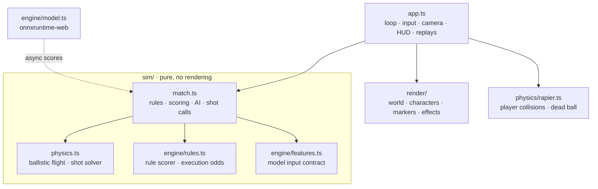

# Architecture

## Game (`game/src`)

- **One simulation, three consumers.** `Match` runs in the browser, in Vitest, and in `selfplay.ts` for
  generating training data, so the rules the model learns from are the rules you play under.
- **Deterministic ball flight while a rally is live.** Gravity-only steps are exact, so the shot solver's
  analytic launch velocities land where intended and AI interception plans stay valid. Rapier takes over
  only after the point is decided.
- **Two scorers.** The rule engine answers immediately and supplies execution odds (how often each option
  errs or wins outright). The ONNX model re-scores options asynchronously; the AI pre-scores while the
  ball is in the air, and your grades update when the model answers (within about 250 ms, otherwise the
  rule engine's grade stands).
- **Slow-motion calls.** When a legal contact point is within reach in the next half second, time scales
  to 8.5% and the decision panel opens. Committing restores full speed; the swing happens when the ball
  reaches you, and footwork quality feeds execution error.

## Pipeline (`ml/dink_ml`)

| Module | Input → output |
|---|---|
| `court.py` | landmark pixels → homography (pixels ↔ court feet) |
| `track.py` | video → per-frame player and ball positions (YOLO + ByteTrack) |
| `events.py` | ball track → hits and bounces |
| `shots.py` | tracks + events + rally outcomes → shot table in the feature format |
| `train.py` | shot tables → LightGBM → `shot_value.onnx` + `model_card.json` |
| `features.py` | the contract, mirrored from the game and checked by a parity test |

## Roblox game (`roblox/`)

`roblox/src/shared` is a port of `game/src/sim` and `game/src/engine` to Luau, with no Roblox API calls,
so `roblox/tests/run.luau` runs it headlessly. The server (`roblox/src/server`) owns one match: human
players move their own characters, and their positions feed the simulation each frame; AI fills the
other slots. Clients replay the ball from each hit's launch state, render AI players from a pose
stream, and send shot calls back as remote events. See [roblox/README.md](../roblox/README.md).
