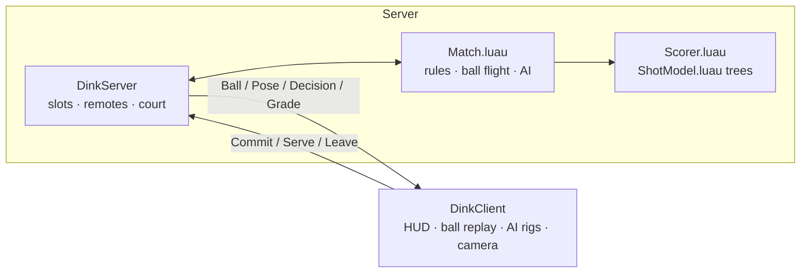

# Dink Engine for Roblox

The Roblox version of the game: 2v2 pickleball doubles where AI fills every open spot. Play alone
against three AI players, with time slowing down for each shot call, or with up to three friends in
real time. Every shot is graded against the same trained shot-value model as the web game,
converted to Luau so it runs on the Roblox server.

## Open it in Roblox Studio

1. Get `dink-engine.rbxl`: download it from the latest CI run (Actions → CI → artifact
   **dink-engine-roblox**) or build it yourself (below).
2. In Roblox Studio: **File → Open from File…** and pick the file.
3. Press **Play** (F5) to play solo. For multiplayer, use **Test → Clients and Servers** with 2–4
   players.
4. **File → Publish to Roblox** to put it online. In **Game Settings → Avatar**, keep the avatar type
   on **R15**: paddle swings are animated on R15 shoulder and waist joints (R6 avatars can still play,
   without the swing animation).

The court is built by the server when the game starts. To edit the venue in Studio, press Play, copy
`Workspace.Court`, stop, and paste it into the place: the builder leaves an existing `Court` model alone.

## Controls

| | Keyboard and mouse | Touch |
|---|---|---|
| Move | WASD | Thumbstick |
| Pick a shot | 1 Dink · 2 Drop · 3 Drive · 4 Speed-up · 5 Lob · 6 Put-away | Tap a shot card |
| Aim | Mouse over the opponents' court | Tap the court (also hits) |
| Hit or serve | Click or Space | Tap the court |
| Leave an out ball | L | Leave it card |
| Eval map / footwork assist / camera | E / F / C | Menu buttons |

Solo play adds menu buttons for a new match, the 12 drills, and the opponents' level: Club (the default) or Pro.

## How it works



- `src/shared/` (ReplicatedStorage.Dink) is a line-by-line port of the web game's simulation:
  `Rules` (rule engine and execution odds), `Features` (the 21-feature model contract), `Physics`
  (exact ballistic ball flight), `Match` (rules, AI movement and shot choice, shot calls, scoring),
  `Drills`, and `ShotModel`, the LightGBM model exported as Luau tables. None of it touches Roblox
  APIs, so it is tested headlessly.
- `src/server/` (ServerScriptService.DinkServer) runs one authoritative match. Players take slots in the
  order near-right, far-left, near-left, far-right; empty slots are AI. Character positions feed the
  simulation every frame; human shot calls arrive as validated remote events.
- `src/client/` (StarterPlayerScripts.DinkClient) replays the ball locally from each hit's position
  and velocity (the flight is deterministic, so it matches the server), draws the AI players from a
  20 Hz pose stream, and runs the shot-call interface, eval map, footwork assist and court camera.
- Slow motion is only used when one person is on court. With several people, shots are called in
  real time: a shot picked in advance fires when the ball arrives.

## Build and test

Tools: [Rojo](https://rojo.space) 7.6 (builds the place), the [Luau](https://luau.org) CLI
(engine tests) and [Lune](https://lune-org.github.io/docs) (plays the built place headlessly).

```bash
luau roblox/tests/run.luau                                        # 15 engine, model and match tests
rojo build roblox/default.project.json -o roblox/build/dink-engine.rbxl
lune run roblox/tests/lune/smoke.luau roblox/build/dink-engine.rbxl
```

The smoke test loads the built place with real Roblox instance types, runs the server and client
scripts unchanged, and plays solo, drills, four-player doubles and players leaving, through the real
UI (number keys, mouse aim, clicks). `rojo serve roblox/default.project.json` with the Rojo Studio
plugin live-syncs the scripts into Studio while you edit.

## Updating the model

`python -m dink_ml.train … --luau ../roblox/src/shared/ShotModel.luau --luau-fixture ../roblox/tests/fixtures/ModelFixture.luau`
exports the Luau model next to the ONNX one; the **Retrain model** workflow does this automatically.

## Publishing from GitHub

The **Publish to Roblox** workflow (Actions tab) builds the place and uploads it with the Open Cloud
place-publishing API. It needs a `ROBLOX_API_KEY` secret (an API key with the `universe-places`
Write permission for your experience) and `ROBLOX_UNIVERSE_ID` and `ROBLOX_PLACE_ID` repository
variables. Run it with **Saved** to update the place for Studio, or **Published** to go live.
